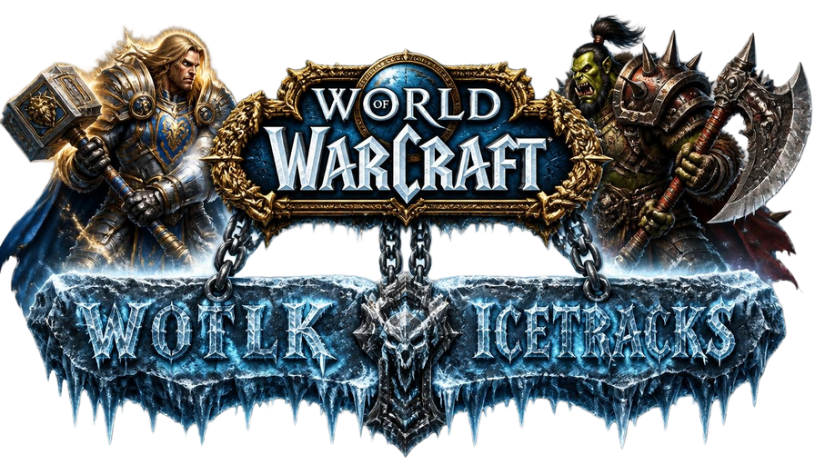

# Warcrafted — Base de datos de World of Warcraft: Wrath of the Lich King

## Qué es este proyecto

Este repositorio es un fork de [AoWoW](https://github.com/azerothcore/aowow), el visor de base
de datos de World of Warcraft 3.3.5 (Wrath of the Lich King) mantenido por la comunidad de
[AzerothCore](https://www.azerothcore.org/). AoWoW en sí es, a su vez, una reescritura completa
inspirada en el famoso sitio de base de datos "del cohete sonriente rojo" (Wowhead), pensada desde
el origen para servidores privados.

**Este fork añade sobre AoWoW/AzerothCore:**

- Correcciones de compatibilidad con **PHP 8.4** (varias constantes y comportamientos obsoletos
  que rompían el arranque o generaban errores fatales falsos).
- Corrección de bugs reales en la adaptación a AzerothCore que venían del proyecto base:
  autenticación unificada con AzerothCore rota por un typo de constante, interpretación incorrecta
  de la máscara de especialización de talentos en el perfilador, y un bug que colapsaba por
  completo los datos de "Zonas" cuando el cliente usado no es inglés (ver más abajo,
  **"Parches aplicados"**).
- Rebranding completo del sitio (nombre, logo, textos) y localización al español prácticamente
  completa (traducciones que el AoWoW original dejaba en inglés).
- Login **unificado** con el juego y el resto de servicios del proyecto: cualquier cuenta de
  `acore_auth` funciona aquí sin pasos adicionales (ver **"Autenticación unificada con AzerothCore"**).

No me atribuyo ningún crédito por el diseño original, el código base de AoWoW ni los scripts del
lado del cliente — todo eso es obra de los mantenedores originales de AoWoW y de la comunidad de
AzerothCore. Este proyecto **no está pensado para uso comercial**.

## Requisitos

- Servidor web con **PHP ≥ 8.0** (probado y en producción sobre PHP 8.4), con las extensiones:
  - `SimpleXML`
  - `GD`
  - `Mysqli`
  - `mbstring`
- **⚠️ La extensión `Intl` de PHP debe estar DESACTIVADA.** AoWoW define su propia clase `Locale`,
  que choca con la clase `Locale` de la extensión Intl — el núcleo se niega a arrancar mientras
  Intl esté cargada. Si usas `mod_php` (un único proceso PHP para todo el servidor, no PHP-FPM) y
  necesitas Intl para otro proyecto en la misma máquina, la alternativa es aislar AoWoW en su
  propio pool de PHP-FPM en vez de desactivar Intl globalmente.
- **MySQL** ≥ 5.6 (no MariaDB — usa comportamientos específicos de MySQL en algunas consultas).
- Para extraer los datos del cliente de WoW necesitas `cmake` y alguna de estas herramientas:
  - [MPQExtractor](https://github.com/Sarjuuk/MPQExtractor) / [FFmpeg](https://ffmpeg.org/download.html) / [BLPConverter](https://github.com/Sarjuuk/BLPConverter) (opcional, para convertir imágenes con problemas de canal alfa)
  - En Windows puede ser más cómodo usar [MPQEditor](http://www.zezula.net/en/mpq/download.html), [FFmpeg (build Windows)](http://ffmpeg.zeranoe.com/builds/) y [BLPConverter (build Windows)](https://github.com/PatrickCyr/BLPConverter)
- El reencodeo de audio puede requerir [lame](https://sourceforge.net/projects/lame/files/lame/3.99/) o [vorbis-tools](https://www.xiph.org/downloads/) (que a su vez puede requerir `libvorbis`/`libogg`).

En Debian/Ubuntu, instala las extensiones de PHP con:

```bash
sudo apt install php-gd php-xml php-mbstring -y
sudo phpdismod intl   # si el módulo Intl está activo — ver aviso arriba
```

### Recomendado

Para mejorar mucho la precisión de los puntos de aparición de criaturas y objetos del mundo, activa
en tu `worldserver.conf`:

```
Calculate.Creature.Zone.Area.Data = 1
Calculate.Gameoject.Zone.Area.Data = 1
```

## Instalación paso a paso

### 1. Clonar el repositorio

```bash
git clone https://github.com/tortosi/aowow.git aowow
cd aowow
```

Si vas a extraer datos del cliente tú mismo, clona también la herramienta de extracción **fuera**
del repo de AoWoW (no forma parte de este proyecto):

```bash
git clone https://github.com/Sarjuuk/MPQExtractor.git tools-external/MPQExtractor
cd tools-external/MPQExtractor && cmake -B build && cmake --build build
```

### 2. Bases de datos

Necesitas **4 bases de datos** MySQL:

| Base de datos | Contenido |
|---|---|
| `acore_aowow` (nueva, propia de este proyecto) | Todos los datos que AoWoW genera y sirve |
| `acore_world` (de tu AzerothCore) | Objetos, criaturas, misiones, hechizos... |
| `acore_auth` (de tu AzerothCore) | Cuentas de usuario, para el login unificado |
| `acore_characters` (de tu AzerothCore) | Personajes, para el Perfilador |

El usuario MySQL que uses necesita **privilegios completos** sobre `acore_aowow`, e idealmente solo
**lectura** sobre las otras tres (AoWoW no necesita escribir en ellas, salvo el Perfilador, que sí
necesita lectura sobre `acore_characters`).

Crea la base y su estructura:

```bash
mysql -u <usuario> -p -e "CREATE DATABASE acore_aowow CHARACTER SET utf8mb4 COLLATE utf8mb4_unicode_ci;"
mysql -u <usuario> -p acore_aowow < setup/db_structure.sql
```

AoWoW necesita además la tabla `spell_learn_spell`, que **no viene por defecto en una instalación
estándar de AzerothCore** — impórtala en tu base `acore_world`:

```bash
mysql -u <usuario> -p acore_world < setup/spell_learn_spell.sql
```

### 3. Permisos de escritura

El servidor web necesita poder escribir en estos directorios (y crear los que falten):

- `cache/`
- `config/`
- `static/download/`
- `static/widgets/`
- `static/js/`
- `static/uploads/`
- `static/images/wow/`
- `datasets/`

### 4. Configurar la conexión a las bases de datos

```bash
php aowow --database
```

Asistente interactivo: te pedirá host, usuario, contraseña y nombre de cada una de las 4 bases de
datos. Genera `config/config.php` (fuera de git a propósito, contiene credenciales — nunca lo
subas a un repositorio).

### 5. Extraer los datos del cliente (MPQ)

Copia los siguientes directorios de los MPQ del cliente a `setup/mpqdata/<localeCode>/`
(**minúsculas** — p. ej. `eses` para el cliente español, `enus` para el inglés), respetando el
orden de los parches base (`common`, `common-2`, `expansion`, `lichking`, `patch`, `patch-2`,
`patch-3`, `patch-A`) seguido de los específicos del locale
(`locale-<CC>`, `expansion-locale-<CC>`, `lichking-locale-<CC>`, `patch-<CC>`, `patch-<CC>-2`,
`patch-<CC>-3`), sobrescribiendo los archivos más antiguos si se solicita:

```
DBFilesClient/
Interface/WorldMap/
Interface/FrameXML/GlobalStrings.lua
Interface/TalentFrame/
Interface/Glues/Credits/
Interface/Icons/
Interface/Spellbook/
Interface/PaperDoll/
Interface/GLUES/CHARACTERCREATE/
Interface/Pictures/
Interface/PvPRankBadges/
Interface/FlavorImages/
Interface/Calendar/Holidays/
Sound/
```

**Importante:** `Cfg::LOCALES` en la configuración determina qué locales están realmente activos.
En AoWoW el **idioma de la interfaz y el locale de los datos del cliente son la misma cosa** — si
activas un locale sin haber extraído sus datos, la web se rompe para cualquiera que caiga en ese
idioma. Si solo vas a dar soporte a un idioma (como hace esta instancia, solo español), restringe
`LOCALES` a ese único valor durante `php aowow --configure`.

Reencodea los `.wav` extraídos a `ogg/vorbis`:

```bash
ffmpeg -i archivo.wav -f ogg archivo.wav_
```

**⚠️ El flag `-f ogg` es obligatorio.** Sin él, `ffmpeg` no reconoce el formato de salida por la
extensión `.wav_` (no estándar) y falla en silencio para todos los archivos. La extensión final
esperada por `setup/tools/filegen/soundfiles.ss.php` es `<archivo>.wav_` / `<archivo>.mp3_`.

### 6. Configuración inicial y generación de datos

```bash
php aowow --setup
```

Asistente guiado paso a paso (base de datos → configuración de sitio → generación SQL → generación
de archivos → cuenta de administrador). Tardará un buen rato, sobre todo compilando imágenes de
mapas y zonas.

Si en vez del asistente completo prefieres ir paso a paso o regenerar solo una parte más adelante:

```bash
php aowow --configure E <CLAVE> "<valor>"     # cambiar un ajuste de configuración
php aowow --sql=<tipo,tipo,...> --force        # regenerar datos de un tipo concreto
php aowow --build=<tipo,tipo,...> --force      # regenerar archivos de un tipo concreto
```

**⚠️ Nunca uses `--sql` o `--build` sin el signo `=` seguido del nombre exacto.** El framework CLI
interpreta `--sql` sin argumento como "reconstruir absolutamente todo lo registrado", no solo el
tipo que querías — puede tardar más de una hora y pone el sitio en mantenimiento mientras dura.

**⚠️ Nunca pongas un `timeout` a un `php aowow --sql=... --force` ni a `--build=...`.** Son scripts
que empiezan con `TRUNCATE` sobre tablas en producción; cortarlos a mitad deja la tabla a medias.
Déjalos terminar siempre.

### 7. Autenticación unificada con AzerothCore

Este fork viene configurado para autenticar directamente contra `acore_auth.account` (la misma
tabla que usa el propio juego), en vez de mantener una tabla de usuarios propia de AoWoW. Esto se
controla con:

```
ACC_AUTH_MODE = 3   (AUTH_MODE_ACORE)
```

La primera vez que una cuenta existente de `acore_auth` inicia sesión en AoWoW, se crea
automáticamente una fila vinculada en `aowow_account` (columna `extId` = id de `acore_auth.account`).
Es retroactivo y automático — no hace falta migrar ni crear cuentas manualmente.

Para dar permisos de administrador a una cuenta, que esa persona inicie sesión una vez (para que se
cree su fila en `aowow_account`) y luego:

```sql
UPDATE aowow_account SET userGroups = 2 WHERE user = '<nombre_de_usuario>';
```

(`2` = grupo administrador; ver `includes/defines.php` para el resto de grupos si necesitas un rol
distinto — editor, moderador, etc. son máscaras de bits, se pueden sumar.)

### 8. Perfilador de personajes (opcional)

Activa `PROFILER_ENABLE = 1` con `php aowow --configure`. Usa un proceso en segundo plano
(`prQueue`) que se lanza solo cuando alguien pide ver un personaje y se apaga al vaciar la cola —
no hace falta un cron ni un servicio permanente.

El reino debe tener un `timezone`/región **real** en `acore_auth.realmlist` (no `1`, que AoWoW
interpreta como "reino de desarrollo", visible solo para administradores). Tras cambiar la región,
regenera dos archivos:

```bash
php aowow --build=realms --force
php aowow --build=realmmenu --force
```

## Parches aplicados en este fork (respecto a AoWoW/AzerothCore original)

Todos son correcciones de bugs reales, no cambios de comportamiento/preferencia:

- **`includes/user.class.php`**: `CFG_ACC_AUTH_MODE` (constante inexistente) → `Cfg::get('ACC_AUTH_MODE')`
  en `isValidName()`. Era un typo real del proyecto base al añadir `AUTH_MODE_ACORE`: causaba un
  error fatal en **cualquier intento de login** en modo AzerothCore.
- **`includes/profiler.class.php`**: el `specMask` de `character_talent` se convierte con `>> 1`
  antes de usarlo como índice. En AzerothCore `character_talent.specMask` es una **máscara de
  bits** (1 = spec 0), no un índice plano como asume el código original — sin este arreglo, los
  talentos se guardaban en la especialización equivocada.
- **`setup/tools/sqlgen/zones.ss.php`** y varios `setup/tools/sqlgen/*.ss.php` más: el proyecto
  base asume que `name_loc0` (inglés) de los datos DBC del cliente siempre está poblado, y lo usa
  para hacer `JOIN`/`LIKE`. Si usas un cliente **no inglés**, esa columna está vacía y esas
  consultas fallan en silencio o producen resultados corruptos — colapsaba por completo la sección
  de "Zonas" y dejaba visibles en el sitio público un montón de hechizos/objetos de prueba interna
  de Blizzard que deberían estar ocultos.
- **`includes/kernel.php`** / **`includes/utilities.php`**: varias correcciones de compatibilidad
  con PHP 8.4 (uso de la constante obsoleta `E_STRICT`, un `case E_USER_ERROR` duplicado que hacía
  que los errores reportados con `trigger_error(..., E_USER_ERROR)` se descartaran en silencio, y
  un manejador de errores fatales que marcaba como "Fatal Error" cualquier aviso de PHP aunque el
  script hubiera terminado con éxito).
- **`setup/tools/clisetup/dbconfig.us.php`**: el asistente de configuración de base de datos ya no
  marca la base `world` como desactualizada solo por tener versionado `ACDB` (AzerothCore) en vez
  de `TDB` (TrinityCore) — ese chequeo solo tenía sentido para TrinityCore.
- **`pages/genericPage.class.php`**: los scripts de página inyectados dinámicamente (`?data=...`)
  ahora sobreviven a un acierto de caché — antes se perdían porque vivían en una propiedad privada
  no serializada, rompiendo silenciosamente ~30 páginas del sitio cuando se servían desde caché.

## Solución de problemas

**P: La extensión Intl de PHP está activa y el sitio no arranca / da error fatal en `Locale`.**

R: Es un choque directo con la clase `Locale` propia de AoWoW. Desactívala: `sudo phpdismod -s
apache2 intl` (y `-s cli intl` si también usas el CLI). Si necesitas Intl para otro proyecto en el
mismo servidor con `mod_php`, la alternativa es migrar AoWoW a su propio pool PHP-FPM.

**P: La página aparece en blanco, sin ningún estilo.**

R: El contenido estático no se está sirviendo — o usas SSL y AoWoW no lo detecta, o `STATIC_HOST`
no está bien definido. Revísalo con `php aowow --configure`.

**P: Error fatal: "No se puede heredar la función abstracta ... previamente declarada".**

R: Tienes varios módulos de caché de opcode de PHP activos a la vez (Zend OPcache y algún otro).
Desactiva todos menos uno.

**P: No se pudo conectar a la base de datos.**

R: Revisa `config/config.php`. Si tu contraseña de MySQL contiene el carácter `#`, sustitúyelo por
su forma *URL-encoded* `%23` (y lo mismo con cualquier otro carácter especial que dé problemas).

**P: Falta `Markup.js` / errores de consola sobre archivos JS no encontrados.**

R: A veces la configuración falla al copiar las plantillas `tools/filegen/templates/*.in` a
`static/js/` por permisos. Comprueba que el servidor web puede escribir en `static/js/` y relanza
`php aowow --build=markup --force`.

**P: ¿Cómo consigo el visor 3D de personajes en el Perfilador?**

R: No es posible con los medios actuales — el visor original usaba Flash (retirado de todos los
navegadores) y Wowhead eliminó los recursos de su visor WebGL que AoWoW referenciaba. Esta
instancia usa como alternativa un retrato plano (icono de raza/género/clase). Un visor WebGL propio
es un proyecto aparte, no cubierto por este fork.

**P: Solo hay datos para español (`eses`) — ¿por qué no aparecen otros idiomas?**

R: Es una decisión de configuración de esta instancia (`Cfg::LOCALES` restringido). El idioma de
interfaz y el locale de datos del cliente son la misma cosa en AoWoW — activar un idioma sin haber
extraído sus datos rompería la web para cualquiera que cayera en él. Si quieres dar soporte a más
idiomas, repite el paso 5 (extracción MPQ) para cada locale adicional y añádelo a `LOCALES`.

## Créditos

- El equipo original de **AoWoW** y la comunidad de **AzerothCore**, por el trabajo real de fondo
  que este fork solo adapta y corrige.
- @mix — script PHP original para analizar `.blp`/`.dbc`.
- @LordJZ — clase contenedora de DBSimple; base de la clase de usuario.
- @kliver — implementación base de subida de capturas de pantalla.
- @Sarjuuk — mantenimiento del proyecto AoWoW adaptado a AzerothCore.

Por favor, no consideres este proyecto un intento de apropiación indebida del trabajo original: es
"nos encantó vuestra base, y la hemos adaptado y corregido para que funcione bien en nuestro propio
servidor AzerothCore".
